# Gameplay

Following table shows the exact steps that can be found in the game:

| # | TV                                     |   Game Master                          | Description
|---|----------------------------------------|----------------------------------------|-----------------
| 1 | 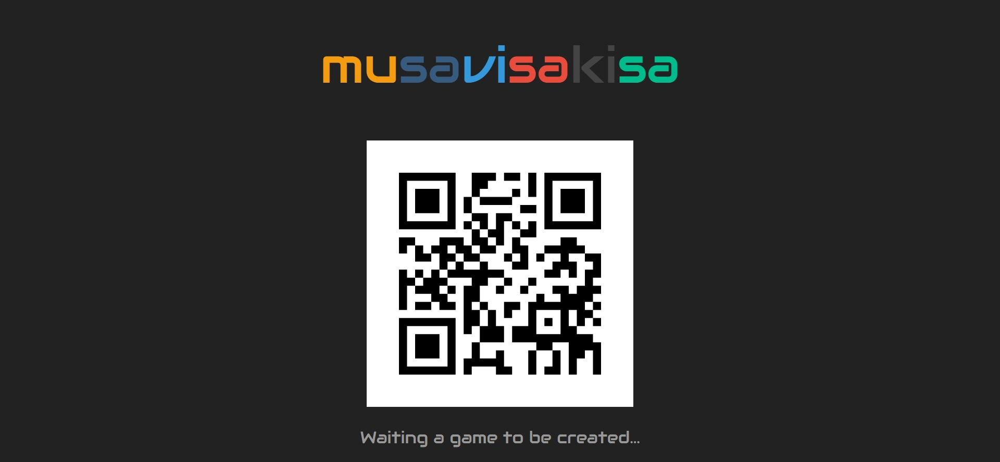  | 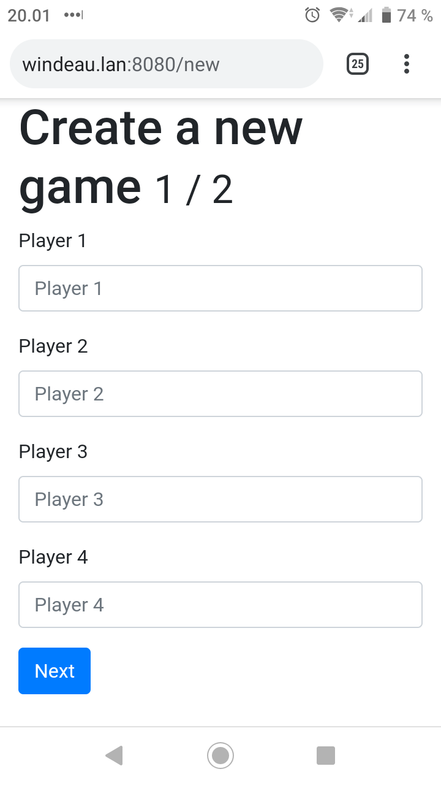 | Game Master creates a new game and give number of players and names for them.
| 2 |   | 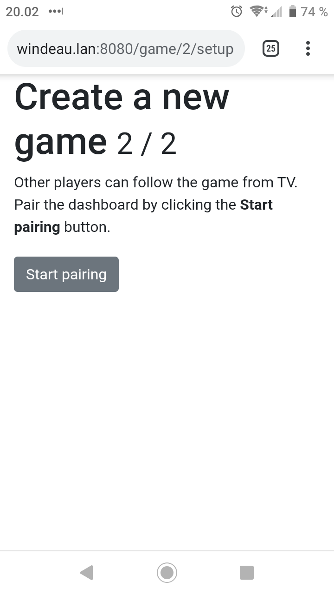     | Once game has set up, you need to pair it with TV.
| 3 |   | 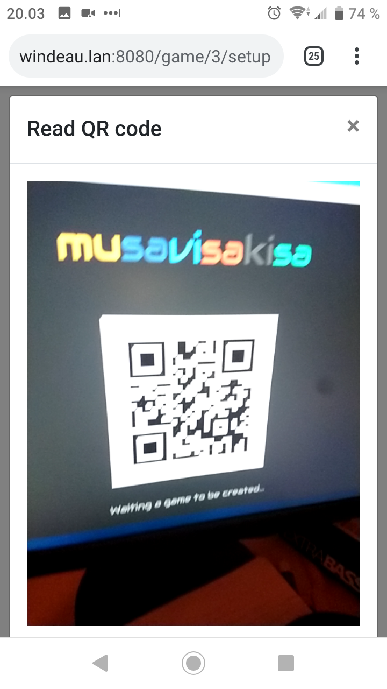         | Give the browser access to camera and read the QR code shown in the TV.
| 4 | 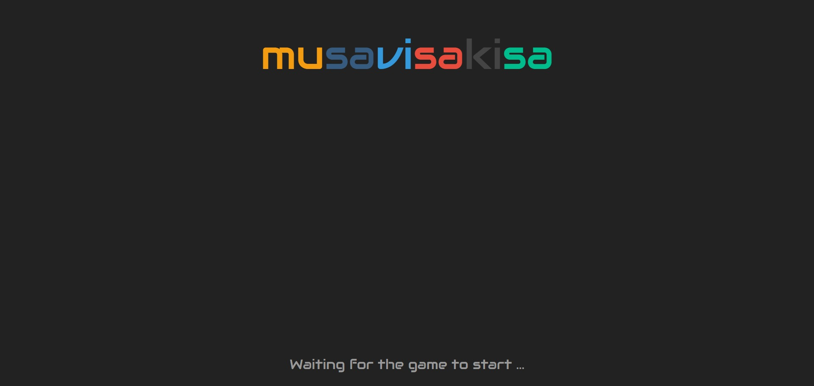 | 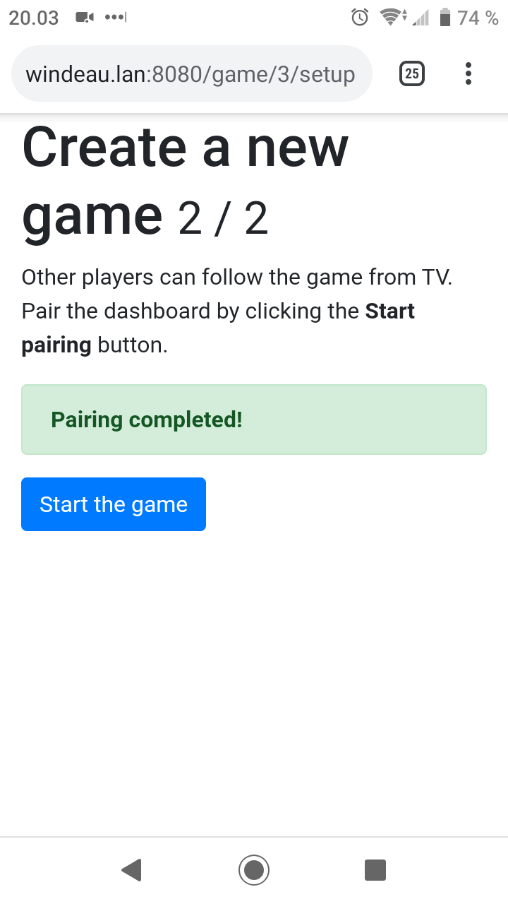         | Pairing has been completed. You can now press "Start the game". Make sure that the players are ready for the first track.
| 5 | 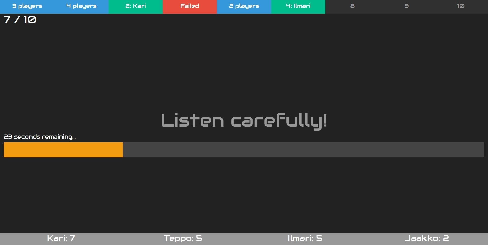 | 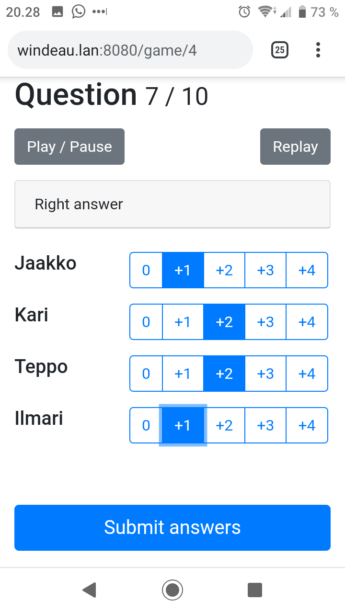         | The game is on! The game master has now control of the game and can give score for each player. Read the Rules to know how to score each player.
| 6 | 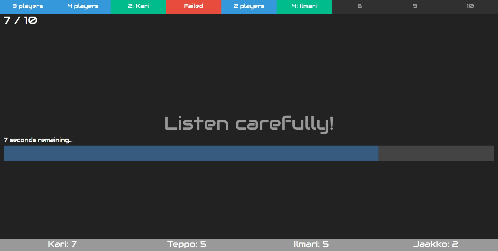 |          | After 10 seconds of the track the progressbar turns into normal blue and double points are no longer available.
| 7 | 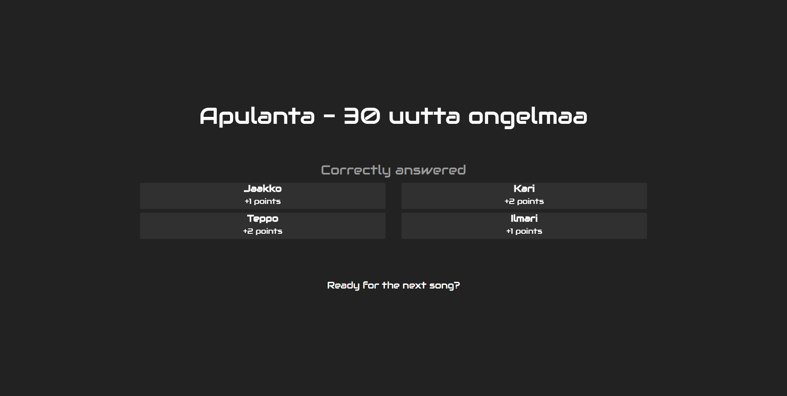 | 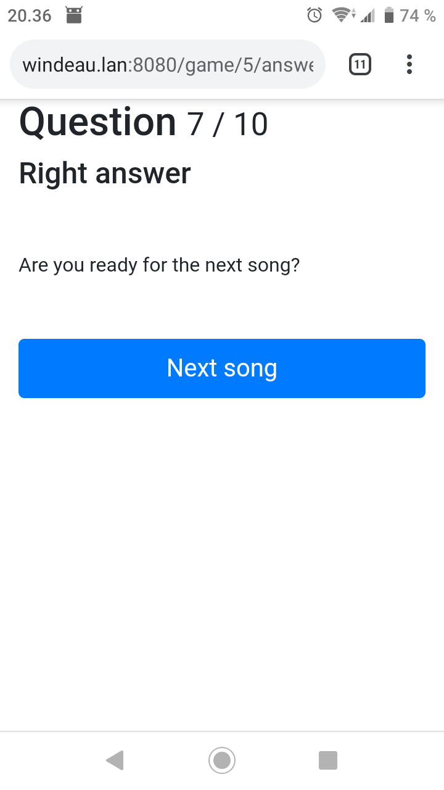 | After the game master has submitted the answer, players can see results from the TV. The TV also shows the correct answer.
| 8 | 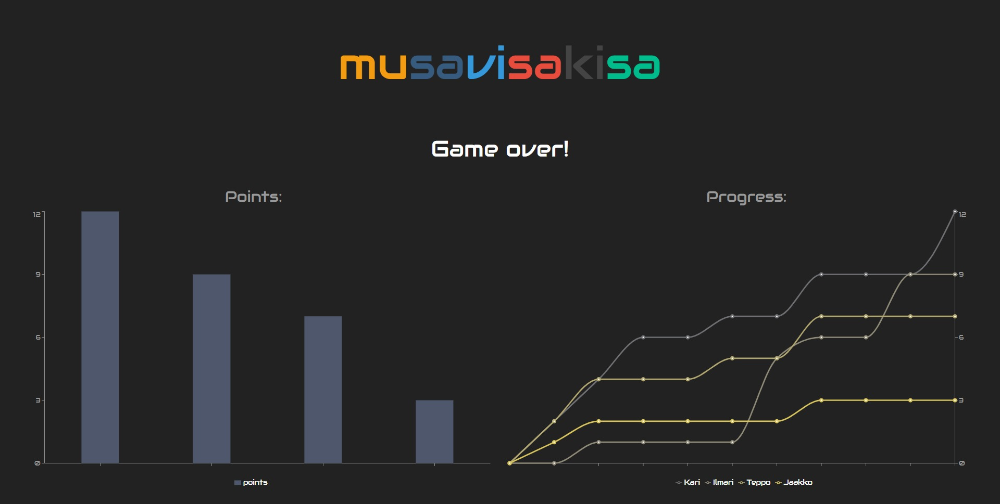 | 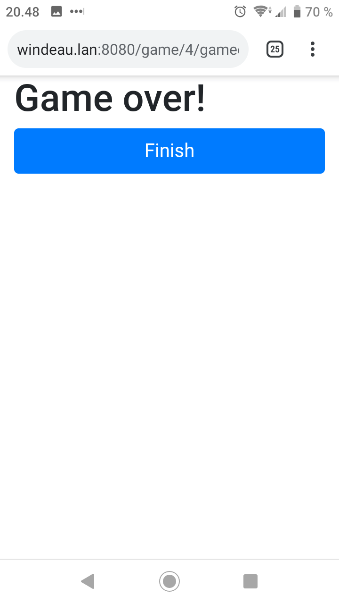 | After the final track, there is a game over -screen that shows the winner and players progression through the game. After click "Finnish" the TV returns to the QR-code state and a new game can be created.
