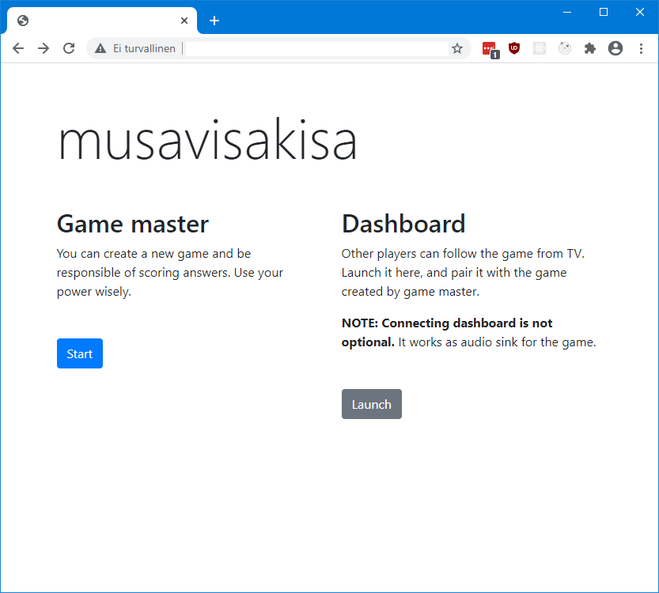

# Getting started

## Set up development environment

Change your current working directory to: `yt-musicquiz\ytmusicquiz-deploy`, which contains deployment-related files. There you have environment for development work that uses Docker Compose. Below are the exact instructions needed to bring the system up:

1. Build dev environment:

        docker-compose -f .\docker-compose.yml -f .\docker-compose.dev.yml build

2. Start dev environment:

         docker-compose -f .\docker-compose.yml -f .\docker-compose.dev.yml up

## Access the environment

You can open the browser with URL:

http://localhost:8080/

And you should see an similiar web page as below:

