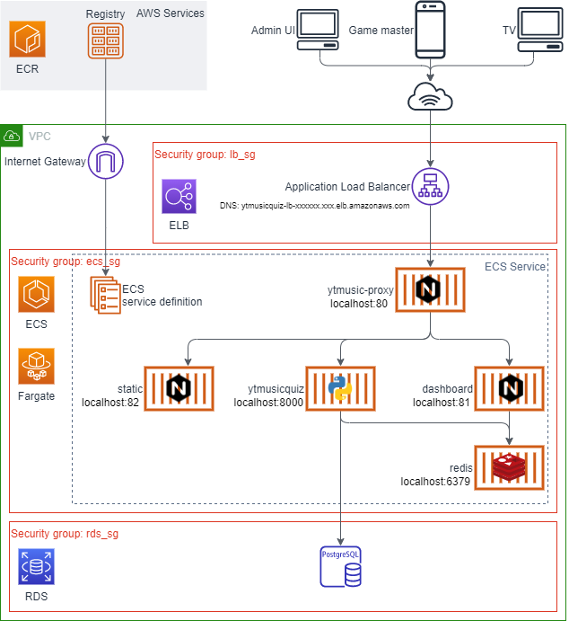

# Production environment

The production environment uses Terraform as a solution to manage infrastructure as code. It has been written to utilize hosted services provided by AWS and does not easily convert to another cloud provider. However, it's possible to do so, because the application uses only open-source -software to implement its features. AWS services are only used to automate and orchestrate the deployment in order to avoid maintenance overhead and minimize possible failure points, so it should be apretty stable environment.

The environment starts with an instance of AWS Virtual Private Cloud, which is the largest group of the environment: It contains almost all resources that Terraforms provisions. You should create a new VPC per YTMusicQuiz-instance to provide enough separation and isolation between instances. In the infrastructure diagram, you can see that the Elastic Container Registries does not belong in VPC and therefore can be shared between multiple instances.

In terms of security, there are three security groups: One for a load balancer, one for business logic, and one for database-layer. Only traffic from upper security group allowed (the diagram container arrows to show traffic flow visually) and there is no direct access to the database server at all. All administrative actions must be done through the Admin UI.

Current architecture minimizes the running costs of the infrastructure, so it does not provide a solution for backup/restore, disaster recovery, or high availability. These functionalities can be added by extending existing templates.

The infrastructure uses AWS Fargate -solution to set up an environment that does not need any virtual machine to avoid any unnecessary maintenance costs.

# Steps to set up your environment

Change your current working directory to: `yt-musicquiz\ytmusicquiz-deploy`, which contains production env-related files and execute the following steps in order.

### 1. Set up AWS resource:

Run the following command:

    > terraform apply

    [... snip ...]

    Plan: 24 to add, 0 to change, 0 to destroy.

    Do you want to perform these actions?
      Terraform will perform the actions described above.
      Only 'yes' will be accepted to approve.

    Enter a value: yes

    [... snip ...]

    Apply complete! Resources: 24 added, 0 changed, 0 destroyed.

    Outputs:

    docker_registry = xxxxxx.dkr.ecr.xxx.amazonaws.com
    http_url = ytmusicquiz-lb-xxxxxx.xxx.elb.amazonaws.com

Execution will take a long time if this is the first time you're building  an environment to AWS.

### 2. Prepare Docker environment

Copy `docker_registry`-URL from the Output values and create a new file
called `.env` with the following content:

    DOCKER_REGISTRY=xxxxxxxx.xxx.xxx.xx-xxxx-x.amazonaws.com

### 3. Build images

Build images using Docker Compose

    docker-compose build

This will build the application from scratch and save the images on your
local development machine.

### 4. Push images to the ECR registry

Make sure you have valid authentication:

    > aws2.exe ecr get-login
    docker login ...
    > docker login ...
    Login Succeeded

(Execute the output of `aws2`)

Finally, use Docker compose to push the images:

    docker-compose push

### 5. Navigate to the application

Use `http_url` from the console output of `terraform apply` command and open it with the browser.

You should see the front page of the application.

Now you can access the Admin Panel using `/admin/`-URL , which brings the login page. The default admin credentials in:

    admin:adminpass

Make sure you change the password after login!